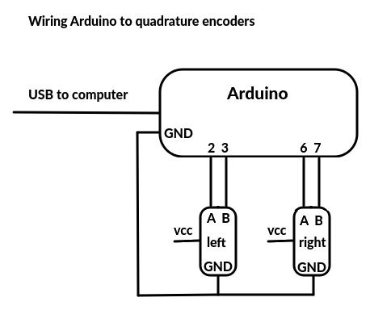
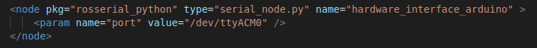

# encoder_tick_pub
encoder_tick_pub.ino is a ROS (Robot Operating System) publisher node that runs on
an Arduino and publishes an std_msgs::Int16 (-32,768 to 32,767) wheel encoder ticks
for both left and right wheels. Tested on Arduino Nano Every. It should also work with the Wifi rev2, Due, Mega, or other Arduino boards that have at least four pins available for interrupt callback usage (may have to alter pin assignments for some boards). It will not work with the Regular Nano, Uno, or Mini. See [this reference](https://www.arduino.cc/reference/en/language/functions/external-interrupts/attachinterrupt) for more info about the interrupts available for various boards.

Part of the [practical_robot_tools](../README.md) collection at https://github.com/lbrombach/practical_robot_tools.git   
Author: Lloyd Brombach   
lbrombach2@gmail.com    
November 2021
 
  
 

## Attribution
The main program depends on QuadratureEncoderInt.h - a quadrature encoder library that is a modified version of the QuadratureEncoder.h released by Dr. Rainer Hessmer (April, 2010).

 

## Wiring

Adjust pin numbers as necessary for your board. vcc is probably 5 volts but check your own hardware. Also check the current consumption of your encoders and how mch your Arduino can supply - it may be safer to supply it from another source rather than the 5v pin on the Arduino. Regardless, the Arduino must share a ground with the encoders.  

  

## Programming the Arduino
The QuadratureEncoderInt16.h file needs to be copied into a folder called QuadratureEncoderInt16 under the libraries folder that is used by the Arduino environment so that it becomes accessible to Arduino programs (For me, this is ~/Arduino/libraries). Once that is in place, check that your wiring matches the pin assignments and upload the encoder_tick_pub.ino to the Arduino as you would any other sketch. 
  

## rosserial_python

rosserial_python is not part of this package, but is required to handle message-passing between ROS and the Arduino. All that is needed is to run it (easiest from launch file) with the Arduino's port set as a parameter. Example launch file entry:   

Alternatively, rosserial_python can be started from the command line with:
- rosrun rosserial_python serial_node.py /dev/ttyACM0
