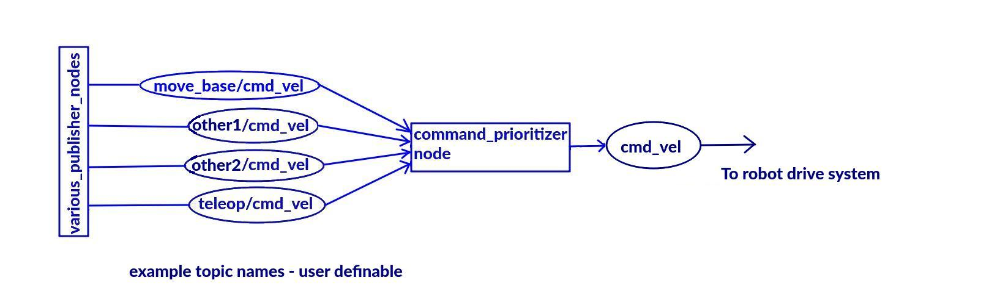
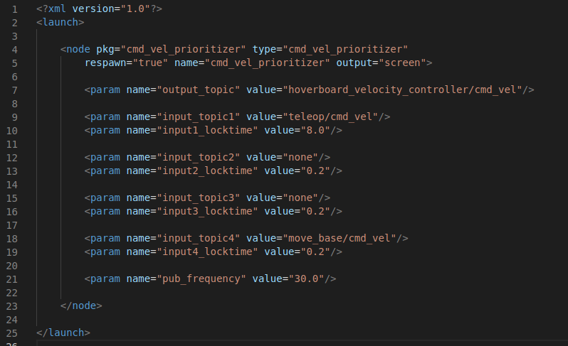

# cmd_vel_prioritizer
A utility node to allow different geometry_msgs::Twist messages to have different priorities. Part of the [practical_robot_tools](../README.md) collection at https://github.com/lbrombach/practical_robot_tools.git   
Author: Lloyd Brombach   
lbrombach2@gmail.com    
November 2021
 
  

 
## Description and Operation:
The node subscribes to up to four Twist messages and only republishes the one with the highest priority.
This could, for example, allow teleop commands to override autonomously issued commands without fighting them.   

  

## Usage:
There is a topic name parameter and a delay parameter for each of the input topics. WIth so many parameters, it is easier to use a launch file than to use rosrun to start the node. In the launch file - 
- Change the output topic to the one that your motor drive controller subscribes to 
- Change the four input topic parameters to the topics your various nodes will use, with topic number one being the highest priority and topic four the lowest priority. (Leave unused topics named as "none" so they won't be unnecessarily advertised)
- The inputx_locktime parameters define how long a higher-priority topic will maintain a lock on robot control after a message on that topic is recieved. For example, topics 2, 3 and 4 will be unable to control the robot for input1_locktime seconds after the last message is recieved on topic1. Change the four locktime parameters, if desired.
- Set the pub_frequency parameter, if desired. This is the rate at which the program runs (in HZ).
- launch the node either:
    - From command line
        - roslaunch cmd_vel_prioritizer cmd_vel_prioritizer.launch
    - Or include in launch file
        - \<include file="$(find cmd_vel_prioritizer)/launch/cmd_vel_prioritizer.launch" />
 

Example Launch File:

  

## Subscriptions
- topic1 (default: teleop/cmd_vel) ([geometry_msgs/Twist](http://docs.ros.org/en/melodic/api/geometry_msgs/html/msg/Twist.html))
    - The highest priority topic

- topic2 (default: none) ([geometry_msgs/Twist](http://docs.ros.org/en/melodic/api/geometry_msgs/html/msg/Twist.html))
    - The 2nd highest priority topic
    
- topic3 (default: none) ([geometry_msgs/Twist](http://docs.ros.org/en/melodic/api/geometry_msgs/html/msg/Twist.html))
    - The third highest priority topic
    
- topic4 (default: "move_base/cmd_vel") ([geometry_msgs/Twist](http://docs.ros.org/en/melodic/api/geometry_msgs/html/msg/Twist.html))
    - The lowest priority topic
    
 

## Publications
- output_topic (default: "cmd_vel") ([geometry_msgs/Twist](http://docs.ros.org/en/melodic/api/geometry_msgs/html/msg/Twist.html))
    - The topic that gets republished

 

## Parameters
- output_topic (string, default: cmd_vel)
    - use to change the output topic

- input_topic1 (string, default: teleop/cmd_vel)
    - the name of the topic that should have the highest priority
    
- input1_locktime (double, default: 4.0)
    - the amount of time in seconds following last valid topic1 message to ignore lower priority inputs

- input_topic2 (string, default: none)
    - the name of the topic that should have the second highest priority
    
- input2_locktime (double, default: 0.2)
    - the amount of time in seconds following last valid topic2 message to ignore lower priority inputs
    
- input_topic3 (string, default: none)
    - the name of the topic that should have the third highest priority

- input3_locktime (double, default: 0.2)
    - the amount of time in seconds following last valid topic3 message to ignore lower priority inputs    

- input_topic4 (string, default: move_base/cmd_vel)
    - the name of the topic that should have the lowest priority
    
- input4_locktime (double, default: 0.2)
    - Not relevant because topic4 is the lowest priority topic

- pub_frequency (double, default: 30.0)
    - the rate in HZ that the program runs

  

## Contributing, bug reports, etc:
Please use the issues and bug reporting system for bugs and feature requests. With many projects, a job, a family, I can't promise
to get to feature requests very quickly, but am definitely listening for feedback to make improvement and will prioritize bugs. I am open to
pull requests if you'd like to contribute. I can be contacted by email at lbrombach2@gmail.com. 

