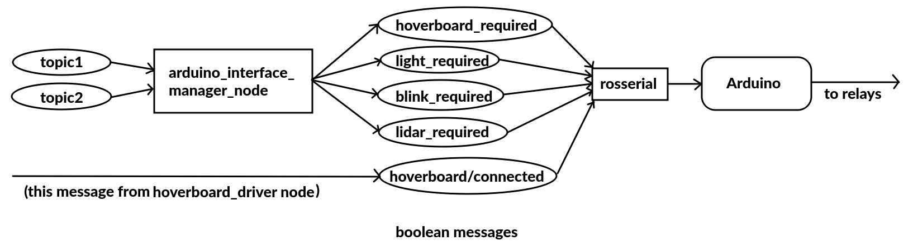
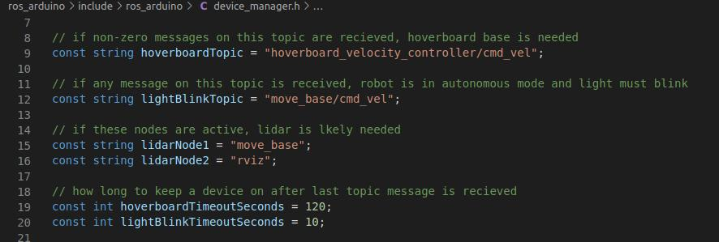
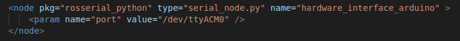
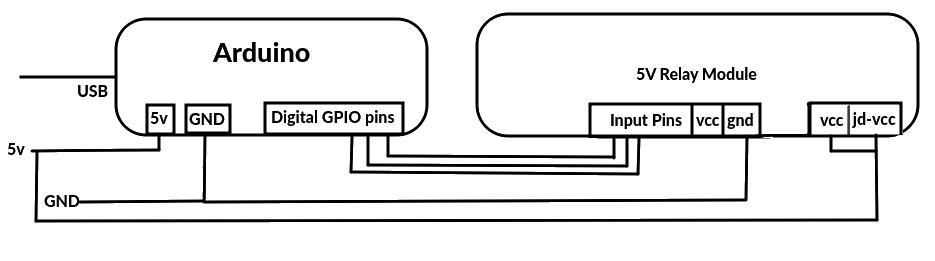
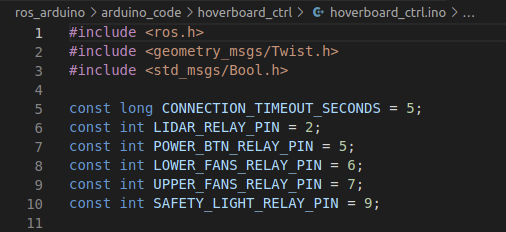
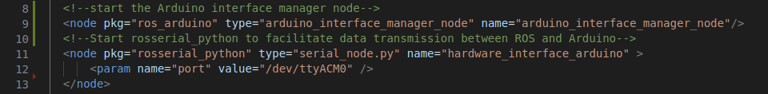

# ROS Arduino

## Overview
This package contains a node that determines what hardware needs to be powered at any given moment by monitoring several topics and checking if several nodes are active. The node then publishes boolean messages which an Arduino subscribes to, and activates relays based on the value of each message. Rosserial is used to interface data transmission between ROS and the Arduino's serial interface. This package also contains a folder with the code that runs on the Arduino.

  

## arduino_interface_manager_node 
It is the job of this node to publish boolean messages indicating whether a given device is required or not. If the device is required by some part of the system, a boolen true message is published, else the node publishes false on that topic. There is a separate topic for each device that the Arduino controls. The method of determining whether a device is required varies by device. Currently, the four device_required messages and their decision criteria are as follows:

 

**Subscribes**
- topic1 /hoverboard_velocity_controller/cmd_vel ([geometry_msgs::Twist](http://docs.ros.org/en/api/geometry_msgs/html/msg/Twist.html))   
    The hard-coded hoverboardTopic topic. Used to determine if the system requires the hoverboard control board to be powered on

- topic2 /move_base/cmd_vel ([geometry_msgs::Twist](http://docs.ros.org/en/api/geometry_msgs/html/msg/Twist.html))   
    The hard-coded lightBlinkTopic topic. Used to determine if the safety light should be blinking

- *Not a subscription, but to determine if the lidar is required this node fetches a list of currently running nodes and checks if either of two designated nodes are running. These hard-coded const strings are currently "move_base" and "rviz" but instructions to change are in the Details section below.

**Publishes**
- topic hoverboard_required ([std_msgs::Bool](http://docs.ros.org/en/noetic/api/std_msgs/html/msg/Bool.html))   
    True when the the hoverboard control board is required. Goes false after hoverboardTimeoutSeconds have passed without a non-zero command on the hoverboardTopic topic.
- topic light_required ([std_msgs::Bool](http://docs.ros.org/en/noetic/api/std_msgs/html/msg/Bool.html))   
    True when the safety light is required (per IGVC rules, this is active any time the system is powered so this is always true when this node is running)
- topic light_blink_required ([std_msgs::Bool](http://docs.ros.org/en/noetic/api/std_msgs/html/msg/Bool.html))    
    True when the safety light should be blinking instead of steady (should blink when in autonomous mode)
- topic lidar_required ([std_msgs::Bool](http://docs.ros.org/en/noetic/api/std_msgs/html/msg/Bool.html))    
    True when the lidar is required

**Details** 

This node is intended to work with an Arduino Nano Every that is running the [ros_arduino.ino program](./arduino_code/ros_arduino/ros_arduino.ino) in the arduino_code folder in this package. Subscriber topic names are hard-coded as const strings in [device_manager.h](./include/ros_arduino/device_manager.h) and can be changed there if necessary. Timeout values (hoverboardTimeoutSeconds & lightBlinkTimeoutSeconds) can also be changed here. Recompiling is necessary after changes.  

 

**TODO**

 In the future topic names, node names, and timeout values should be parameterized for flexibility that does not require recompiling.

## rosserial_python
**Description**

rosserial_python is not part of this package, but is required to handle message-passing between ROS and the Arduino. All that is needed is to run it (easiest from launch file) with the Arduino's port set as a parameter. Example launch file entry:   

## Arduino Nano Every
**Description**

The Arduino's job is to handle powering devices on and off via common 5v relay modules. It subscribes to boolean messages (issued by the  arduino_interface_manager_node) and generally ensures a device or action is active if its message is true. There is a timeout where it turns devices off if no messages are recieved for a time. Currently there are three relays controlled by the Arduino:
- Hoverboard Power Button Relay: The arduino compares the hoverboard_required message with the hoverboard_connected message and if they do no match, it pulses the power button relay to "press" hoverboard control board power button.
- Safety Light Relay: The Arduino blinks the light_blink_required is true, otherwise it keeps it on as long as light_required is true. 
- Lidar Power Relay: The Arduino turns on power to the lidar device when lidar_required is true
 

**Wiring**

The Arduino receives and sends data via a USB cable to the computer. Although power to Arduino (requires 5v) can come from the USB cable, we observed that the voltage was sagging enough that is was not able to operate the relay module. This problem was solved by running 5v to the Arduino and relay module directly from the 5V supply on the robot. We connected digital pins from the Arduino to the input pins on the relay module. The relay contacts were then connected to the various devices.   

 

**The Code**

Arduino programs are commonly called "sketches." The sketch that runs on the Arduino for this package is a sketch called  [ros_arduino.ino](./arduino_code/ros_arduino/ros_arduino.ino) and can be found in the arduino_code folder. For instructions on how to use the Arduino IDE, how to upload sketches, etc, see the Arduino tutorials at https://docs.arduino.cc/learn.
 

**Pin Numbers and other constants**

Pin numbers and constants are declared at the top of the ros_arduino.ino file and can be changed to suit needs. The constant CONNECTION_TIMEOUT_SECONDS is to ensure that relays are shut off if this much time has elapsed since a message has been received on a given topic (for example if the ros master shuts down while the devices are on). The sketch will have to be re-ruploaded to the Arduino for changes to take effect.    
 

 

**Subscribes**
- topic hoverboard_required ([std_msgs::Bool](http://docs.ros.org/en/noetic/api/std_msgs/html/msg/Bool.html))   
- topic light_required ([std_msgs::Bool](http://docs.ros.org/en/noetic/api/std_msgs/html/msg/Bool.html))   
- topic light_blink_required ([std_msgs::Bool](http://docs.ros.org/en/noetic/api/std_msgs/html/msg/Bool.html))    
- topic lidar_required ([std_msgs::Bool](http://docs.ros.org/en/noetic/api/std_msgs/html/msg/Bool.html))    

**Publishes**
- none
 

**Running the Arduino**

Once the program has been uploaded to the Arduino, it begins to run automatically as soon as the Arduino is powered on. There are no commands needed to start the Arduino, but rosserial_python must be running in order to facilitate the exchange of data from ROS to the Arduino - see the rosserial_python entry above.
  

## Launching the components
For this package to all work together the arduino_interface_manager_node, rosserial_python, and the Arduino all have to be running. The Arduino runs automatically when powered. Here is an example launch file entry to start the arduino_interface_manager_node and rosserial_python. 
 

 

**TODO**
Currently, there is a relay to control fan for each of the two electronics enclosures. It would be good if temperature sensors were added and the relays were controlled to maintain some temperature instead of leaving the fans on always. It would be even better if these two relays were replaced with transistors so fan speed could be modulated with demand instead of simple on/off control. 

